# 🌍 LandClassification

## 📌 **Project Overview**
A deep learning-based remote sensing project for land classification using CNN architectures such as ResNet-50, DenseNet-121, and EfficientNet-B0 to categorize various land cover types from .tif satellite images.
The goal is to classify images into seven main categories: construction land, cultivated land, land, objects, transportation, water area, and woodland, by training and evaluating multiple deep learning models for performance comparison.

---

## 📂 **Dataset**
### [📥 Download Dataset](https://pz3gzw.dm.files.1drv.com/y4mXZ63cZF1JqpWtU_BqezsKxYoNK5BxtnQ9PD97LFsU-fOFSdejEP3h5bqGdICIY_M3uzDKRg44l354LtqpgEhqF6Cgm0GbjjFTTkhLz4yrf2zq77t-O2jo7tQrutM1jro1GoHrkX9IdKJ6zluGM3hWgsbDauOs5qB4H9CJ_jKb402N1cAt-4HEaa8uQwa1jrEdqpz35LQTewH5fpRZpHQdg)


The dataset is organized into seven main categories with corresponding subcategories:

```
├── constructionland
│   ├── city_building
│   ├── container
│   ├── residents
│   └── storage_room
│
├── cultivatedland
│   ├── bare_land
│   ├── dry_farm
│   └── green_farmland
│
├── land
│   ├── desert
│   ├── mountain
│   ├── sandbeach
│   └── snow_mountain
│
├── objects
│   ├── airplane
│   ├── pipeline
│   └── town
│
├── transportation
│   ├── airport_runway
│   ├── avenue
│   ├── bridge
│   ├── crossroads
│   ├── highway
│   ├── marina
│   └── parkinglot
│
├── waterarea
│   ├── coastline
│   ├── dam
│   ├── hirst
│   ├── lakeshore
│   ├── river
│   ├── sea
│   └── stream
│
└── woodland
    ├── artificial_grassland
    ├── forest
    ├── mangrove
    ├── river_protection_forest
    ├── sapling
    ├── shrubwood
    └── sparse_forest
```
## 🖼️ **Sample Dataset Images**
### 🏗️ Construction Land - City Building
#### City Building
<p align="center">
  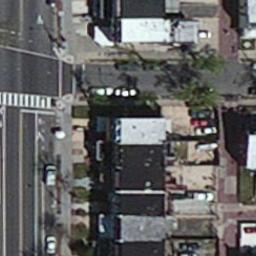
  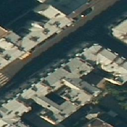
  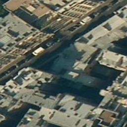
  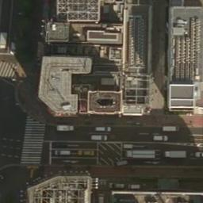
  
</p>

#### Container
<p align="center">
  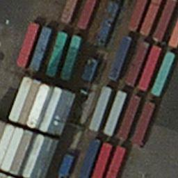
  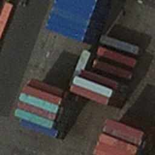
  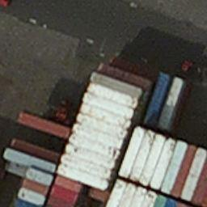
  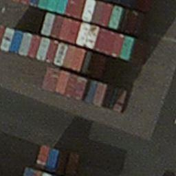
  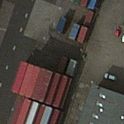
</p>

#### Residents
<p align="center">
  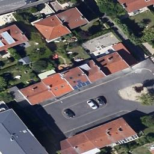
  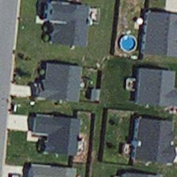
  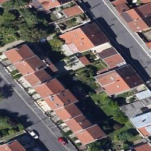
  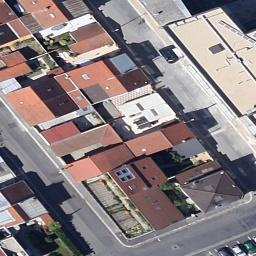
  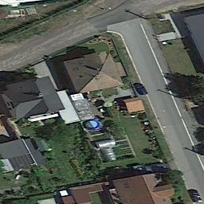
</p>

#### Storage Room
<p align="center">
  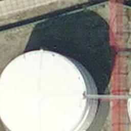
  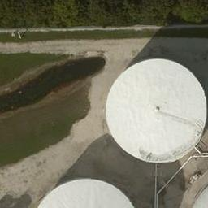
  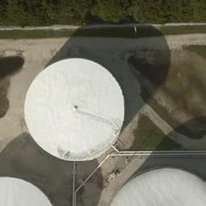
  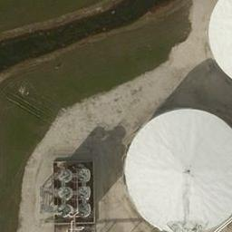
  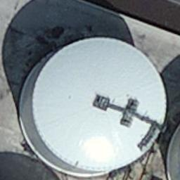
</p>

### 🌾 Cultivated Land - Green Farmland
#### Bare Land
<p align="center">
  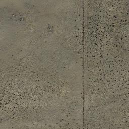
  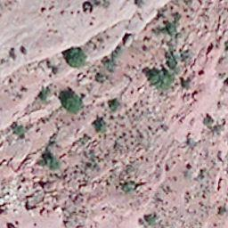
  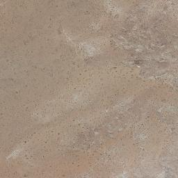
  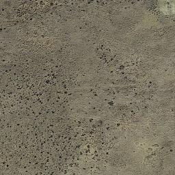
  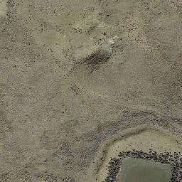
</p>

#### Dry Farm
<p align="center">
  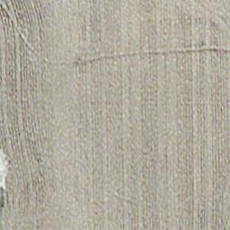
  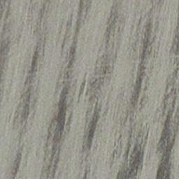
  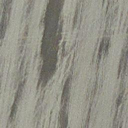
  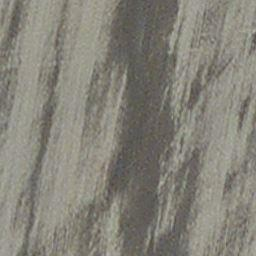
  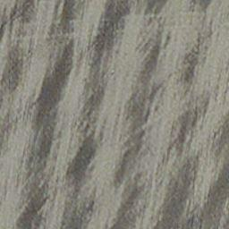
</p>

#### Green Farmland
<p align="center">
  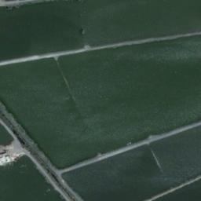
  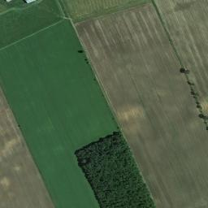
  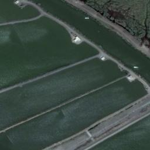
  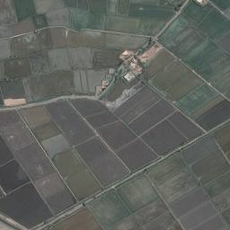
  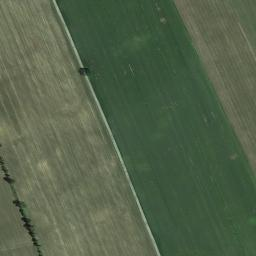
</p>

### 🏜️ Land - Desert
#### Desert
<p align="center">
  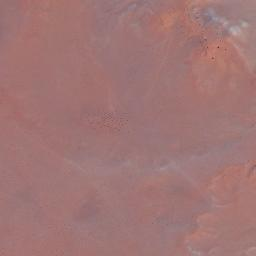
  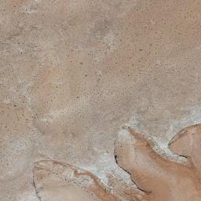
  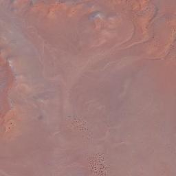
  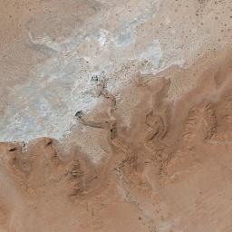
  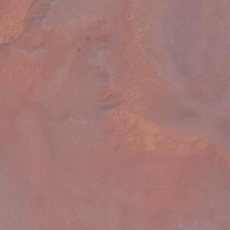
</p>

#### Mountain
<p align="center">
  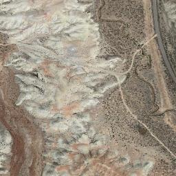
  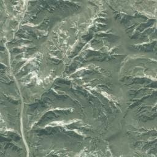
  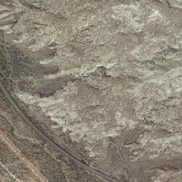
  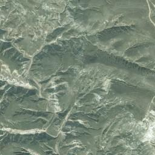
  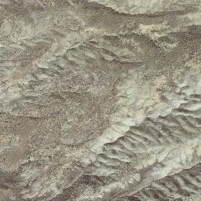
</p>

#### Sandbeach
<p align="center">
  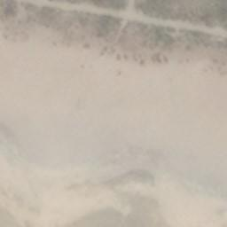
  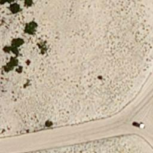
  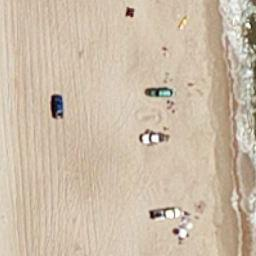
  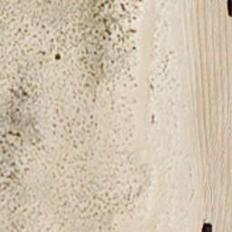
  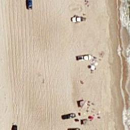
</p>

#### Snow Mountain
<p align="center">
  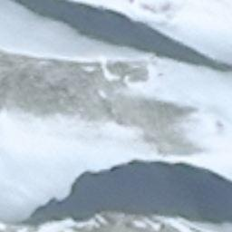
  
  
  
  
</p>

### ✈️ Objects - Airplane
#### Airplane
<p align="center">
  
  
  
  
  
</p>

#### Pipeline
<p align="center">
  
  
  
  
  
</p>

#### Town
<p align="center">
  
  
  
  
  
</p>

### 🚗 Transportation - Highway
#### Airport Runway
<p align="center">
  
  
  
  
  
</p>

#### Avenue
<p align="center">
  
  
  
  
  
</p>

#### Bridge
<p align="center">
  
  
  
  
  
</p>

#### Crossroads
<p align="center">
  
  
  
  
  
</p> 

#### Highway
<p align="center">
  
  
  
  
  
</p>

#### Marina
<p align="center">
  
  
  
  
  
</p>

#### Parkinglot
<p align="center">
  
  
  
  
  
</p>

### 🌊 Water Area - River
#### Coastline
<p align="center">
  
  
  
  
  
</p>

#### Dam
<p align="center">
  
  
  
  
  
</p>

#### Hirst
<p align="center">
  
  
  
  
  
</p>

#### Lakeshore
<p align="center">
  
  
  
  
  
</p>

#### River
<p align="center">
  
  
  
  
  
</p>

#### Sea
<p align="center">
  
  
  
  
  
</p>

#### Stream
<p align="center">
  
  
  
  
  
</p>


### 🌳 Woodland - Forest
#### Artificial Grassland
<p align="center">
  
  
  
  
  
</p>

#### Forest
<p align="center">
  
  
  
  
  
</p>

#### Mangrove
<p align="center">
  
  
  
  
  
</p>

#### River Protection Forest
<p align="center">
  
  
  
  
  
</p>

#### Sapling
<p align="center">
  
  
  
  
  
</p>

#### Shrubwood
<p align="center">
  
  
  
  
  
</p>

#### Sparse Forest
<p align="center">
  
  
  
  
  
</p>

## 📊 **Dataset Analysis**

### 1️⃣ **Sample Distribution per Category**
#### 🏗️ Construction Land - City Building
<p align="center">
  
</p>


#### 🌾 Cultivated Land - Green Farmland
<p align="center">
  
</p>

#### 🏜️ Land - Desert
<p align="center">
  
</p>

#### ✈️ Objects - Airplane
<p align="center">
  
</p>

#### 🚗 Transportation - Highway
<p align="center">
  
</p>

#### 🌊 Water Area - River
<p align="center">
  
</p>

#### 🌳 Woodland - Forest
<p align="center">
  
</p>


## 📊 **AI Models**
#### 🚀 Custom CNN Model
```
class CNNClassifier(nn.Module):
    def __init__(self, num_classes=3):
        super(CNNClassifier, self).__init__()
        self.features = nn.Sequential(
            nn.Conv2d(3, 32, kernel_size=3, stride=1, padding=1),
            nn.ReLU(inplace=True),
            nn.MaxPool2d(kernel_size=2, stride=2),

            nn.Conv2d(32, 64, kernel_size=3, stride=1, padding=1),
            nn.ReLU(inplace=True),
            nn.MaxPool2d(kernel_size=2, stride=2)
        )
        self.classifier = nn.Sequential(
            nn.Flatten(),
            nn.Linear(64 * 32 * 32, 128),
            nn.ReLU(),
            nn.Dropout(0.5),
            nn.Linear(128, num_classes)
        )

    def forward(self, x):
        x = self.features(x)
        x = self.classifier(x)
        return x
```

#### 🚀 Resnet50
```
model = models.resnet50(weights=models.ResNet50_Weights.DEFAULT)
num_ftrs = model.fc.in_features
model.fc = nn.Linear(num_ftrs, num_classes)
```

#### 🚀 DenseNet121
```
model = models.densenet121(weights=models.DenseNet121_Weights.DEFAULT)
num_ftrs = model.classifier.in_features
model.classifier = nn.Linear(num_ftrs, num_classes)
```

#### 🚀 EfficientNet
```
model = models.efficientnet_b0(weights=models.EfficientNet_B0_Weights.DEFAULT)
num_ftrs = model.classifier[1].in_features
model.classifier[1] = nn.Linear(num_ftrs, num_classes)
```

## 📈 **Results Comparison**
#### 🏗️ Construction Land
##### 🚀 Custom CNN Model
<p align="center">
  
  
</p>

##### 🚀 Resnet50
<p align="center">
  
  
</p>

##### 🚀 DenseNet121
<p align="center">
  
  
</p>

##### 🚀 EfficientNet
<p align="center">
  
  
</p>


#### 🌾 Cultivated Land - Green Farmland
##### 🚀 Custom CNN Model
<p align="center">
  
  
</p>

##### 🚀 Resnet50
<p align="center">
  
  
</p>

##### 🚀 DenseNet121
<p align="center">
  
  
</p>

##### 🚀 EfficientNet
<p align="center">
  
  
</p>

#### 🏜️ Land - Desert
##### 🚀 Custom CNN Model
<p align="center">
  
  
</p>

##### 🚀 Resnet50
<p align="center">
  
  
</p>

##### 🚀 DenseNet121
<p align="center">
  
  
</p>

##### 🚀 EfficientNet
<p align="center">
  
  
</p>

#### ✈️ Objects - Airplane
##### 🚀 Custom CNN Model
<p align="center">
  
  
</p>

##### 🚀 Resnet50
<p align="center">
  
  
</p>

##### 🚀 DenseNet121
<p align="center">
  
  
</p>

##### 🚀 EfficientNet
<p align="center">
  
  
</p>

#### 🚗 Transportation - Highway
##### 🚀 Custom CNN Model
<p align="center">
  
  
</p>

##### 🚀 Resnet50
<p align="center">
  
  
</p>

##### 🚀 DenseNet121
<p align="center">
  
  
</p>

##### 🚀 EfficientNet
<p align="center">
  
  
</p>

#### 🌊 Water Area - River
##### 🚀 Custom CNN Model
<p align="center">
  
  
</p>

##### 🚀 Resnet50
<p align="center">
  
  
</p>

##### 🚀 DenseNet121
<p align="center">
  
  
</p>

##### 🚀 EfficientNet
<p align="center">
  
  
</p>

#### 🌳 Woodland - Forest
##### 🚀 Custom CNN Model
<p align="center">
  
  
</p>

##### 🚀 Resnet50
<p align="center">
  
  
</p>

##### 🚀 DenseNet121
<p align="center">
  
  
</p>

##### 🚀 EfficientNet
<p align="center">
  
  
</p>


## 📊 Model Accuracy Performance Comparison of Test Data

| Model            | 🏗️ Construction Land | 🌾 Cultivated Land | 🌍 Land | 🏢 Objects | 🚗 Transportation | 💧 Water Area | 🌲 Woodland |
|-----------------|:-------------------:|:-----------------:|:------:|:--------:|:---------------:|:------------:|:---------:|
| **Custom CNN**   | 0.9140 | 0.9953 | 0.9944 | 0.9701 | 0.9071 | 0.9530 | 0.9681 |
| **ResNet-50**    | 0.9825 | 0.9953 | 0.9870 | 1.0000 | 0.9859 | 0.9741 | 0.9957 |
| **DenseNet-121** | 0.9807 | 0.9976 | 0.9796 | 0.9851 | 0.9919 | 0.9611 | 0.9947 |
| **EfficientNet** | 0.9877 | 0.9976 | 0.9889 | 0.9925 | 0.9859 | 0.9530 | 0.9936 |


## Code
```python
# Download Dataset From Above Link
# Upload required folder in drive and then change path of dataset
# Optional if dataset is in Zip format
data_path = f"/content/drive/MyDrive/hyperspectral_data/{folder_name}.zip"
!unzip {data_path} -d /content/drive/MyDrive/hyperspectral_data/

EXTRACTED_DATA_PATH = f"/content/drive/MyDrive/hyperspectral_data/{folder_name}"
```
### 🏗️ Construction Land 

[](https://colab.research.google.com/drive/167wbYMWg0aX3bfBbVwvf_bi0euPY3639?usp=sharing)

### 🌾 Cultivated Land 
[](https://colab.research.google.com/drive/1p-ZzfHpkxRgxFOiDbLeKXcihgJjjcIwS?usp=sharing)
### 🌍 Land 
[](https://colab.research.google.com/drive/1J3wGX7DwZ0v5zN8ana65DD1N16dg7tDW?usp=sharing)

### 🏢 Objects 
[](https://colab.research.google.com/drive/1fnMFv6EqICzoJ_03i_ZUifu1wSCmByv7?usp=sharing)

### 🚗 Transportation 
[](https://colab.research.google.com/drive/1V9vpR3UiHSNOYCyEUhBPx7gqrzdwUkJn?usp=sharing)

### 💧 Water Area 
[](https://colab.research.google.com/drive/1lSdylOrmj3_e-VGrV8K9TwKbYii_Z1H8?usp=sharing)

### 🌲 Woodland 
[](https://colab.research.google.com/drive/1KtiRxfcTnkVwfdwB9VaPaW9BrnBb9qTp?usp=sharing)


# 📌 Conclusion
EfficientNet emerged as the top performer, achieving the highest overall accuracy across seven land categories. It particularly excelled in Construction Land (98.77%), Cultivated Land (99.76%), and Objects (99.25%), showcasing its strong generalization ability on remote sensing data.

ResNet-50 closely followed, achieving 100% accuracy in the Objects category and maintaining robust performance across all classes. DenseNet-121 also performed well, especially in Cultivated Land (99.76%) and Transportation (99.19%), demonstrating its strength in extracting complex features.

The Custom CNN served as a solid baseline but underperformed in key areas like Transportation (90.71%) and Construction Land (91.40%), highlighting the benefits of deeper, more advanced architectures for high-resolution classification tasks.

EfficientNet offers the best balance of accuracy and efficiency, making it the most reliable choice for multi-class land classification using remote sensing imagery.